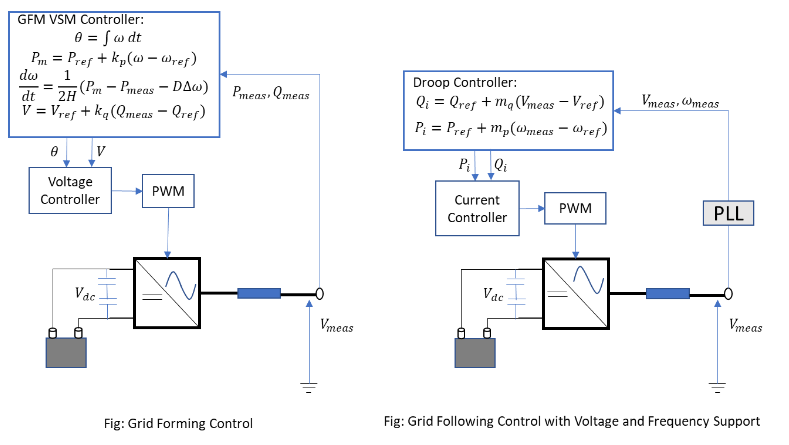
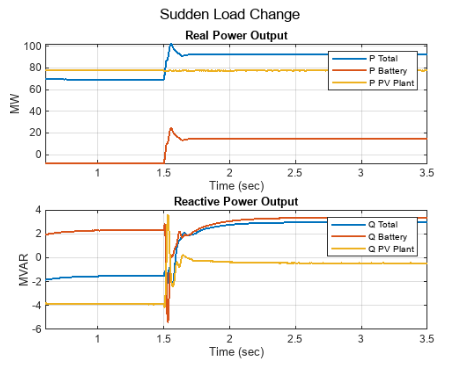
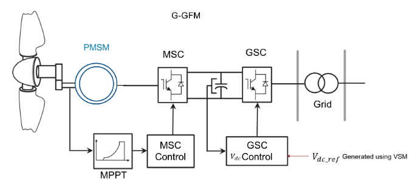
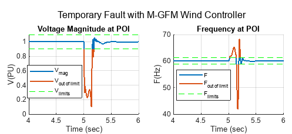
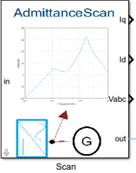
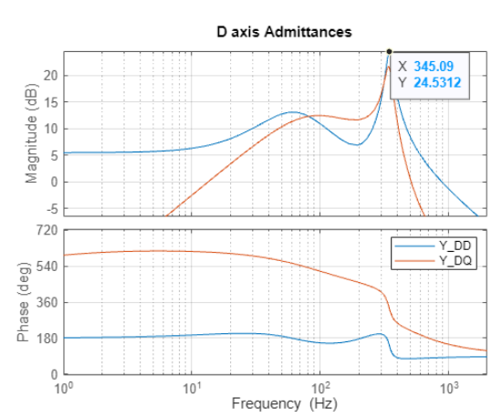

# **Renewable Energy Integration Design with Simscape**
This repository provides design solutions for the operation of power systems with high penetration of renewable energy sources. The developed models comply with current IEEE/IEC and national grid standards.

This repository has the following design solutions:
1. [Performance Evaluation of Grid Forming Battery Energy Storage Systems in Solar PV Plants](https://github.com/simscape/Renewable-Energy-Integration-Simscape?tab=readme-ov-file#performance-evaluation-of-grid-forming-battery-energy-storage-systems-in-solar-pv-plants)
2. [Evaluate Performance of Grid Forming Controls for Type 4 Wind Generators in Wind Farm](#evaluate-Performance-of-Grid-Forming-Controls-for-Type-4-Wind-Generators-in-Wind-Farms)
3. [Assess the Stability of Inverter-Based Resources using Admittance Scan Technique](#assess-the-stability-of-inverter-based-resources-ibrs-using-admittance-scan-technique) 

## Performance Evaluation of Grid Forming Battery Energy Storage Systems in Solar PV Plants
This project evaluates the capabilities of a grid-forming (GFM) battery energy storage system (BESS) in maintaining a stable power system with high penetration of solar photovoltaic (PV) energy sources. 
Use this model to assess the dynamic performance of the BESS connected to the PV plant during normal operation and contingencies, such as a large drop in PV power, significant load change, grid outage, and faults. Simulate the model to verify whether the designed PV plant and BESS unit, along with their associated controllers, conform the performance requirements of the current IEEE 2800 standards. 

This model provides two control modes for the BESS controller:
The first control mode comprises a phase-locked-loop (PLL)-based grid-following (GFL) BESS controller with voltage and frequency support.
The second control mode comprises a virtual synchronous machine (VSM)-based GFM controller.
These figures show the control schemes for the BESS controllers.

These figures show that the BESS with GFM control responds to an increase in load and delivers the real and reactive power required to maintain stable system operation.

## Evaluate Performance of Grid Forming Controls for Type 4 Wind Generators in Wind Farms
This project evaluates the capabilities of a grid-forming (GFM) controller of type-4 wind turbine generators in maintaining a stable power system operation with high inverter-based renewable energy sources penetration. 
Use this model to compare the dynamic performance of the grid-connected wind farm during normal operation and contingencies, such as a large drop in wind power, load change, faults, and generation outage. 
Run this model to test whether the designed GFM wind controller helps the wind farm to conform with the performance requirements that the industry standards recommend.

In this project you can use two GFM control strategies for type-4 wind turbine generators:
- G-GFM: GFM control based on DC-link voltage regulation by the grid-side converter (GSC).  
- M-GFM: GFM control using turbine inertia with DC-link voltage control by the machine-side converter (MSC). 

These figures show the general control scheme for the GFM control of wind turbine generators using G-GFM and M-GFM controllers.

These figures show the response of the wind plant during a fault condition. A stable volatge and frequency indicates that the wind plant is able to ride-through low voltage and frequency variation during the fault, which is in compliance with the ride-through requirements in standards. 
Once the fault clears, the system returns to its pre-fault state in 0.5 sec, which follows the post-fault recovery requirements of standard. 

## Assess the Stability of Inverter-Based Resources (IBRs) using Admittance Scan Technique
This project investigates the use of admittance scanning to detect oscillatory instability in power networks with a high presence of IBRs.
The IBRs can destabilize grid voltage because of undesired interactions between the IBR feedback controller and the variations in equivalent grid impedance at the point of interconnection (POI). 
These interactions cause oscillations in the three-phase voltages and currents, which can cause the protection system to trip the renewable plant. 

You can assess the oscillatory instability using admittance/ impedance scanning technique, where the effective admittance/ impedance of 
the renewable plant and the grid are estimated over a range of different frequencies.

Use this admittance scan block to obtain the admittance spectrum of grid connected IBRs.

Use this model and the block to study the effect of renewable penetration on small signal stability of the power system.

## Setup
- Clone the repository and add to MATLAB&reg; path, then click the 'RenewableEnergyIntegrationwithSimscape.prj' file to get started. 
- In the toolstrip, use the project shortcut buttons to load the model.
- This project requires MATLAB&reg; R2024a or later.

Copyright 2022-2024 The MathWorks, Inc.
