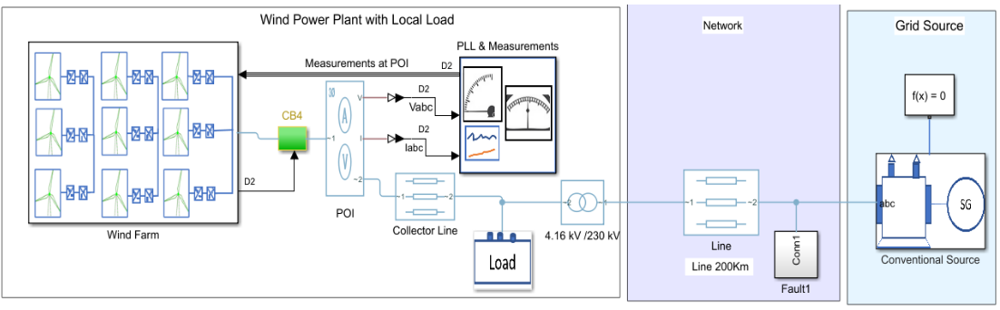
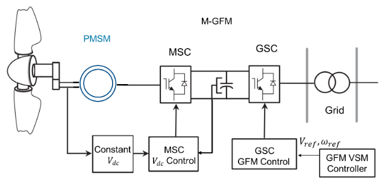
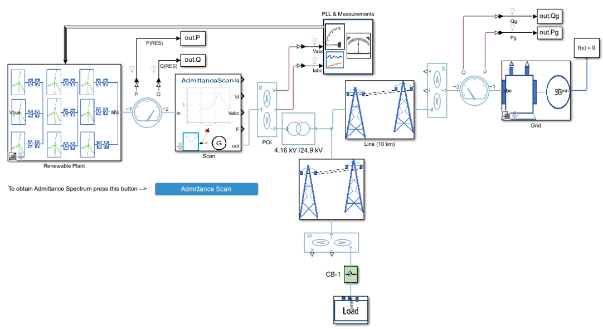
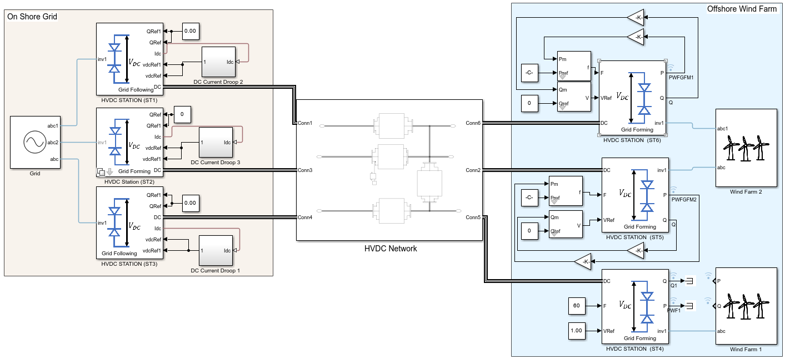
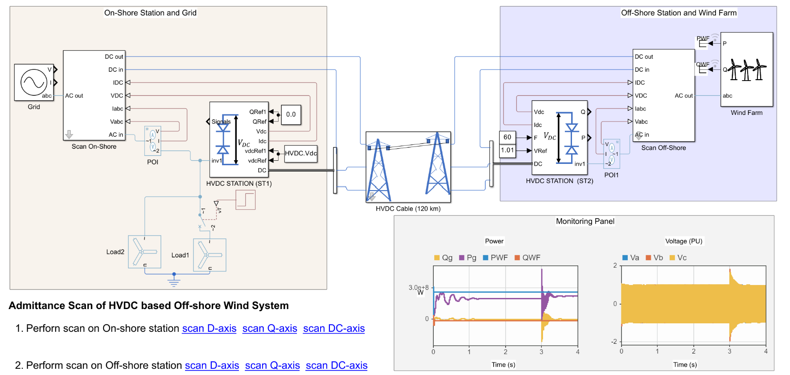

# Renewable Energy Integration Design with Simscape  

Simscape-based engineering solutions for power systems with high renewable energy integration, compliant with IEEE/IEC standards and national grid codes.  

---

## 📖 Table of Contents  

- Overview  
- Engineering Solutions
  - [Grid-Forming BESS in Solar PV Plants](https://viewer.mathworks.com/?viewer=live_code&url=https%3A%2F%2Fwww.mathworks.com%2Fmatlabcentral%2Fmlc-downloads%2Fdownloads%2F45965b03-57ee-472e-a6cb-8bc8dd5d299a%2F1755758349%2Ffiles%2FScriptsData%2FPVPlant%2FBatteryStoragePVPlantGFMMainPage.mlx&embed=web)  
  - [Grid-Forming Controls for Type-4 Wind Generators](https://viewer.mathworks.com/?viewer=live_code&url=https%3A%2F%2Fwww.mathworks.com%2Fmatlabcentral%2Fmlc-downloads%2Fdownloads%2F45965b03-57ee-472e-a6cb-8bc8dd5d299a%2F1755758349%2Ffiles%2FScriptsData%2FWind%20Model%2FMWWindFarmwithGridformingControls.mlx&embed=web)  
  - [Stability Assessment of Inverter-Based Resources](https://viewer.mathworks.com/?viewer=live_code&url=https%3A%2F%2Fwww.mathworks.com%2Fmatlabcentral%2Fmlc-downloads%2Fdownloads%2F45965b03-57ee-472e-a6cb-8bc8dd5d299a%2F1755758349%2Ffiles%2FScriptsData%2FAdmittance%20Scan%2FAdmittanceScanofIBRsDescription.mlx&embed=web)  
  - [Multi-Terminal HVDC Systems for Offshore Wind](https://viewer.mathworks.com/?viewer=live_code&url=https%3A%2F%2Fwww.mathworks.com%2Fmatlabcentral%2Fmlc-downloads%2Fdownloads%2F45965b03-57ee-472e-a6cb-8bc8dd5d299a%2F1755758349%2Ffiles%2FScriptsData%2FHVDC%2FMultiTerminalHVDC%2FMTHVDCModelDescription.mlx&embed=web)  
  - [Admittance-Based Stability of HVDC Links](https://viewer.mathworks.com/?viewer=live_code&url=https%3A%2F%2Fwww.mathworks.com%2Fmatlabcentral%2Fmlc-downloads%2Fdownloads%2F45965b03-57ee-472e-a6cb-8bc8dd5d299a%2F1755758349%2Ffiles%2FScriptsData%2FHVDC%2FScanOfVSCHVDC%2FVSCHVDCScanandStabilityAnalysis.mlx&embed=web)   
- Prerequisites
- Setup
---

## 🌍 Overview  

This repository provides Simscape-based workflows for modeling, simulation, and stability assessment of renewable energy systems. It enables:  

- Study of high IBR penetration and grid stability  
- Comparison of **grid-forming (GFM) vs. grid-following (GFL)** controls  
- Evaluation of compliance with **IEEE 2800, IRE, and national grid codes**  
- Assessment of **fault ride-through (FRT), frequency/voltage support, GFM control for Offshore wind with HVDC**  
- **Impedance/admittance scanning** for oscillation and stability studies  

---

## ⚡ Engineering Solutions  

### Grid-Forming BESS in Solar PV Plants  

|  |  
|-----------------------------------------------|  
| **Description:** A **grid-forming battery energy storage system (GFM-BESS)** stabilizes solar PV plants. Includes **IEEE 2800 compliance tests** for frequency and voltage support. |  

---

### Grid-Forming Controls for Type-4 Wind Generators  

|      |  
|-----------------------------------------------------------------------------|  
| **Description:** Implements two grid-forming strategies for wind generators: **DC-link regulation (GGFM)** and **turbine inertia emulation (MGFM)**. Evaluated under **fault ride-through (FRT)** conditions. |  

---

### Stability Assessment of Inverter-Based Resources  

|  |  
|--------------------------------------------------------------------------------------------------|  
| **Description:** **Admittance scanning** identifies oscillatory instabilities in IBR-dominated systems. Features **Bode plots, eigenvalue tracking, and mode interaction analysis**. |  

---

### Multi-Terminal HVDC Systems for Offshore Wind  

|  |  
|---------------------------------------------|  
| **Description:** Models **multi-terminal VSC-HVDC systems** for offshore wind integration. Tested under **grid faults, asynchronous operation, and variation in grid strength**. |  

---

### Admittance-Based Stability of HVDC Links  

|  |  
|-------------------------------------------|  
| **Description:** Demonstrates **admittance scanning and stability analysis** of a **two-terminal VSC-HVDC system** linking offshore wind farms to the grid. |  

---

## 🛠️ Prerequisites  

- MATLAB® **R2024b** or later  
- Simscape and Simscape Electrical toolboxes  

---

## 🚀 Setup  

Download the repository and open the MATLAB project.

